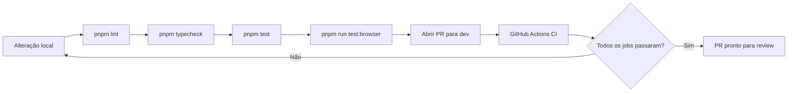

# Testes automatizados — DevOps

Documentação dos testes implementados na issue [#306](https://github.com/realChakrawarti/ingest/issues/306): integração do Vitest com browser mode (provider `preview`) para testes locais.

## Visão geral

O projeto usa [Vitest](https://vitest.dev/) com dois projetos separados:

| Projeto | Ambiente | Quando usar | CI |
|---------|----------|-------------|-----|
| `unit` | Node.js | Funções puras, utilitários | Sim |
| `browser` | Navegador real (preview) | Componentes React com DOM, clipboard, IndexedDB | Não |

**Total:** 3 arquivos de teste, 11 casos (6 unitários + 5 browser).

## Como executar

### Via npm

```bash
# Testes unitários (rápidos, para CI)
npm test

# Testes unitários em watch mode
npm run test:watch

# Testes browser com preview (somente local)
npm run test:browser

# Testes browser em watch mode (abre o navegador para inspeção visual)
npm run test:browser:watch
```

### Via Just

```bash
just test
just test-watch
just test-browser
just test-browser-watch
```

## Estrutura de arquivos

```
vitest.config.ts                          # Configuração dos projetos unit e browser
vitest.browser.setup.ts                   # Setup do browser (CSS global + shim de process.env)
.github/workflows/ci.yml                  # Pipeline GitHub Actions (lint, test, typecheck)
src/
├── shared/utils/
│   ├── format-large-number.ts
│   └── format-large-number.test.ts       # Suite 1 — testes unitários
├── test/fixtures/
│   └── video.ts                          # Fixture compartilhada para testes browser
└── widgets/youtube/
    ├── copy-link.browser.test.tsx        # Suite 2 — testes browser
    └── marked-watched.browser.test.tsx   # Suite 3 — testes browser
```

## Convenções de nomenclatura

| Padrão | Projeto | Exemplo |
|--------|---------|---------|
| `*.test.ts(x)` | `unit` | `format-large-number.test.ts` |
| `*.browser.test.ts(x)` | `browser` | `copy-link.browser.test.tsx` |

Arquivos `*.browser.test.*` são excluídos do projeto `unit` e só rodam com `--project browser`.

---

## Suite 1 — `format-large-number` (unitário)

**Arquivo:** `src/shared/utils/format-large-number.test.ts`  
**Alvo:** `src/shared/utils/format-large-number.ts`  
**Casos:** 6

| Caso | Entrada | Saída esperada |
|------|---------|----------------|
| Valor indefinido | `undefined` | `"0"` |
| Zero | `0` | `"0"` |
| Milhares | `1500` | `"1.5K"` |
| Milhões | `2500000` | `"2.5M"` |
| Bilhões | `3200000000` | `"3.2B"` |
| Abaixo de mil | `999` | `"999"` |

```bash
npm test
```

---

## Suite 2 — `CopyLink` (browser)

**Arquivo:** `src/widgets/youtube/copy-link.browser.test.tsx`  
**Alvo:** componente `CopyLink` em `src/widgets/youtube/components.tsx`  
**Casos:** 2

| Caso | O que valida |
|------|--------------|
| Renderiza o botão | O botão "Copy link" aparece no DOM |
| Copia o link | Ao clicar, `navigator.clipboard.writeText` é chamado com `https://www.youtube.com/watch?v={videoId}` |

**Detalhes técnicos:**
- Usa `vitest-browser-react` com `await render()`
- Mock de `navigator.clipboard` via `vi.fn()`
- Cliques usam `vi.useFakeTimers({ shouldAdvanceTime: true })` (exigido pelo provider preview)

```bash
npm run test:browser
```

---

## Suite 3 — `MarkedWatched` (browser)

**Arquivo:** `src/widgets/youtube/marked-watched.browser.test.tsx`  
**Alvo:** componente `MarkedWatched` em `src/widgets/youtube/marked-watched.tsx`  
**Casos:** 3

| Caso | O que valida |
|------|--------------|
| Renderiza "Marked watched" | Botão visível quando o vídeo ainda não foi marcado como assistido |
| Grava no IndexedDB | Após clicar, `indexedDB.history` recebe `completed` acima do limiar (`watchedPercentage: 94`) |
| Renderiza "Marked unwatched" | Botão alterna quando o histórico já ultrapassa o limiar |

**Setup por teste (`beforeEach`):**
- `localStorage` limpo e preenchido com `LOCAL_USER_SETTINGS`
- IndexedDB resetado (`indexedDB.delete()` + `indexedDB.open()`)
- Fixture de vídeo em `src/test/fixtures/video.ts`

```bash
npm run test:browser
```

---

## Configuração

### `vitest.config.ts`

- **Projeto `unit`:** ambiente Node, inclui `src/**/*.test.{ts,tsx}`, exclui `*.browser.test.*`
- **Projeto `browser`:** provider `@vitest/browser-preview`, instância Chromium, desabilitado em CI (`process.env.CI`)

### `vitest.browser.setup.ts`

- Define `globalThis.process.env` para módulos que dependem de `process` (ex.: `app-config.ts`)
- Importa `src/app/styles/globals.css` para estilos Tailwind nos componentes

### Dependências de desenvolvimento

```
vitest
@vitest/browser-preview
@vitejs/plugin-react
vite-tsconfig-paths
vitest-browser-react
```

### Tipos para typecheck no CI

O arquivo `src/types/static-assets.d.ts` referencia `next/image-types/global`, permitindo que `tsc --noEmit` resolva imports de imagens (ex.: `public/icon.png`) sem rodar `next build` antes.

---

## CI vs local

| Comando | CI | Local |
|---------|----|-------|
| `pnpm lint` | Sim (job **Lint**) | Sim |
| `pnpm typecheck` | Sim (job **Typecheck**) | Sim |
| `pnpm test` | Sim (job **Unit tests**) | Sim |
| `pnpm run test:browser` | Não | Sim |

Os testes browser usam o provider **preview**, que abre um navegador real na máquina do desenvolvedor. Não há suporte a headless nem automação avançada — é voltado para inspeção e validação local. Para CI com browser, seria necessário migrar para `@vitest/browser-playwright` ou `@vitest/browser-webdriverio`.

---

## Pipeline — GitHub Actions

**Arquivo:** `.github/workflows/ci.yml`

O workflow **CI** roda automaticamente em:

- `push` para as branches `dev` e `main`
- `pull_request` direcionados a `dev` ou `main`

Execuções concorrentes na mesma branch são canceladas (`cancel-in-progress`) para economizar minutos de CI.

### Jobs

| Job | Comando | O que valida |
|-----|---------|--------------|
| **Lint** | `pnpm lint` | Regras do `oxlint` (mesmo check do pre-commit via `just lint`) |
| **Unit tests** | `pnpm test` | Projeto Vitest `unit` — 6 casos em `format-large-number` |
| **Typecheck** | `pnpm typecheck` | Compilação TypeScript sem emitir arquivos (`tsc --noEmit`) |

Os três jobs rodam **em paralelo** e são independentes. O PR só fica verde quando todos passam.

### O que o CI não executa

| Item | Motivo |
|------|--------|
| Testes browser (`test:browser`) | Provider `preview` é somente local; o projeto `browser` fica vazio quando `CI=true` |
| `next build` | Exige variáveis de ambiente de produção (Firebase, Sentry, APIs) não disponíveis no runner |
| `oxfmt` | Formatação é responsabilidade do desenvolvedor no pre-commit/local |

### Ambiente do runner

| Configuração | Valor |
|--------------|-------|
| SO | `ubuntu-latest` |
| Node.js | `24.15.0` (conforme `engines` em `package.json`) |
| Gerenciador de pacotes | `pnpm@10.33.2` com `--frozen-lockfile` |
| Cache | Dependências cacheadas via `actions/setup-node` |

### Reproduzir o CI localmente

```bash
pnpm install --frozen-lockfile
pnpm lint
pnpm typecheck
pnpm test
```

Para espelhar o ambiente de CI nos testes unitários:

```bash
CI=true pnpm test
```

### Fluxo recomendado para contribuidores



Passos **B–D** são obrigatórios antes do PR (o CI executa exatamente isso). O passo **E** é opcional, mas recomendado quando há mudanças em componentes testados no browser.

### Troubleshooting

| Falha | Causa comum | Solução |
|-------|-------------|---------|
| **Lint** | Erros de `oxlint` no código alterado | `pnpm lint` localmente e corrigir |
| **Unit tests** | Regressão em utilitários | `pnpm test` e revisar `format-large-number.test.ts` |
| **Typecheck** | Tipos incompatíveis | `pnpm typecheck` e ajustar tipagens |
| `pnpm install --frozen-lockfile` | `pnpm-lock.yaml` desatualizado | Rodar `pnpm install` e commitar o lockfile |

---

## Referências

- [Vitest — Browser Mode](https://vitest.dev/guide/browser/)
- [Vitest — Configuring Preview](https://vitest.dev/config/browser/preview.html)
- [vitest-browser-react](https://github.com/vitest-community/vitest-browser-react)
- Issue: [#306 — Integrate Vitest Browser mode with preview configuration](https://github.com/realChakrawarti/ingest/issues/306)
